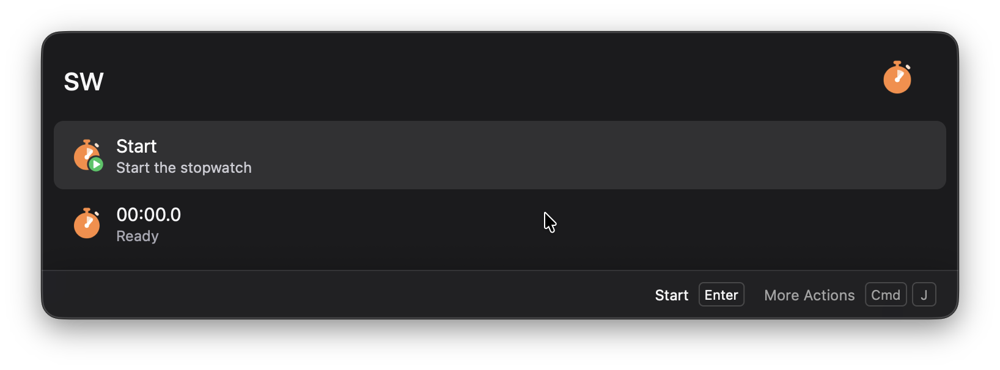
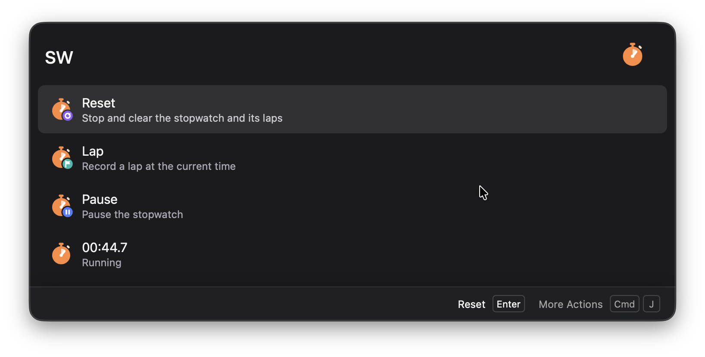
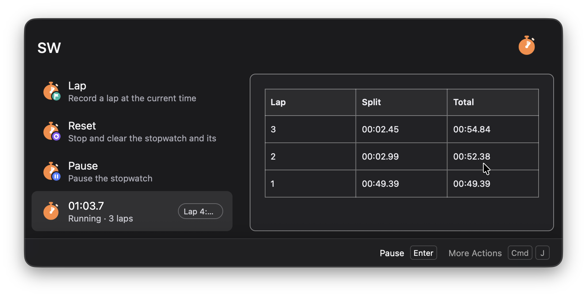

<p align="center">
  
</p>

<h1 align="center">Wox Stopwatch</h1>

A stopwatch plugin for [Wox](https://github.com/Wox-launcher/Wox) v2 that runs in the launcher and records laps.

## Usage

Type `sw` in Wox:

| Result | Action |
| --- | --- |
| `00:12.3` (status row) | Shows the live elapsed time, the lap count and the current lap. Enter starts or pauses it, and the Action Panel has Lap, Reset and Copy time. The preview lists your laps. |
| Start / Pause / Resume | Toggles the stopwatch |
| Lap | Records a lap (only while running) |
| Reset | Stops the stopwatch and clears its laps |

Anything you type after `sw` filters the results, for example `sw lap`.

The stopwatch uses wall-clock time and is saved in the plugin's cache folder, so it keeps running across Wox restarts.

## Screenshots

| | |
| :-- | :-- |
| Ready to start |  |
| Running, with Lap and Reset |  |
| Laps in the preview panel |  |

## Install

- **Development**: in Wox settings, add this repository folder as a local plugin directory.
- **Package**: run `make package` and install the resulting `wox.plugin.stopwatch.wox`.

Requires Wox ≥ 2.0.4 with Python ≥ 3.10.

## Development

```sh
uv venv && uv pip install wox-plugin
.venv/bin/python -m unittest discover -s tests
make lint
```
